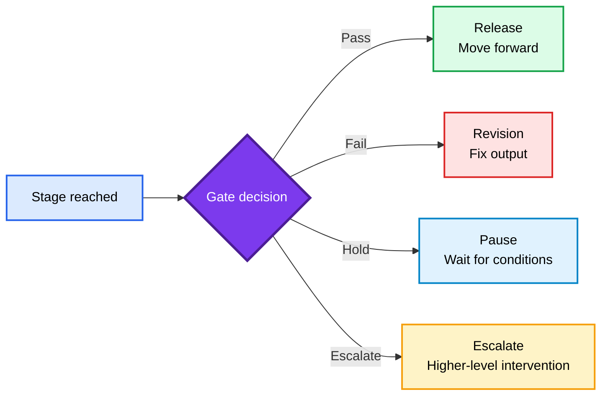
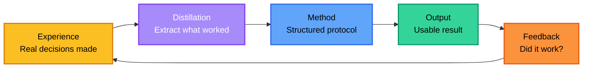

<div align="center">

<h1 style="font-size: 4em; font-weight: 900; margin-bottom: 0.1em; letter-spacing: 0.05em;">KIM</h1>
<p style="font-size: 1.1em; color: #7c3aed; font-weight: 600; margin-top: 0;">DECISION & DELIVERY PROTOCOL</p>

<p>
  <a href="README.md">English</a> |
  <a href="README.zh-CN.md">简体中文</a>
</p>

<p>
  
  
  
  
</p>

</div>

## Overview

**KIM Skill** is what happens when I distill my own lifetime of hard-won decisions into a protocol.

I have been breaking things, fixing things, and making judgment calls under pressure for years — mostly while cursing at code and questioning life choices. This skill is my **distillation**: everything that actually worked, stripped of the profanity (mostly), compressed into a structured method that AI agents can follow.

Most AI skills tell the model *what style to use*. KIM asks a different question: **does the agent actually have a method for reaching a usable result — or is it just improvising with confidence?**

> Think of it as extracting the "judgment yeast" from years of fermented experience, then bottling it so any AI can pour a shot.

Without a method, the model improvises. With KIM, every output follows one spine:

```mermaid
flowchart LR
    subgraph define["Define"]
        I["Intent<br/>What must change"] --> S["Subject<br/>Who experiences it"]
        S --> P["Path<br/>How they get there"]
    end

    subgraph verify["Verify"]
        C["Constraint<br/>Hard limits"]
        E["Evidence<br/>Confirmed or not"]
        MT["Minimum Test<br/>Smallest decider"]
        P --> C --> E --> MT
    end

    subgraph deliver["Deliver"]
        M["Models<br/>Abstract tools"]
        G["Gates<br/>Pass or fail"]
        O["Output<br/>Usable result"]
        MT --> M --> G --> O
    end

    style define fill:#fef3c7,stroke:#f59e0b,color:#000
    style verify fill:#dbeafe,stroke:#2563eb,color:#000
    style deliver fill:#dcfce7,stroke:#16a34a,color:#000

    style I fill:#fbbf24,stroke:#d97706,color:#000,stroke-width:2px
    style S fill:#60a5fa,stroke:#2563eb,color:#000,stroke-width:2px
    style P fill:#34d399,stroke:#059669,color:#000,stroke-width:2px
    style C fill:#fb923c,stroke:#ea580c,color:#000,stroke-width:2px
    style E fill:#a78bfa,stroke:#7c3aed,color:#fff,stroke-width:2px
    style MT fill:#2dd4bf,stroke:#0d9488,color:#000,stroke-width:2px
    style M fill:#f87171,stroke:#dc2626,color:#fff,stroke-width:2px
    style G fill:#818cf8,stroke:#6366f1,color:#fff,stroke-width:2px
    style O fill:#fbbf24,stroke:#d97706,color:#000,stroke-width:2px
```



The operating layer stays abstract — no hardcoded personas. The delivery layer allows concrete evidence when real names, cases, data, or file paths improve trust.

### One-line summary

> Define intent, map the path, verify evidence, run the minimum test, pass the gates, deliver the usable result.

This is not a new concept. Mature decision teams already do this. KIM turns it into a runnable protocol for AI, instead of relying on human discipline alone.

### What KIM is and is not

| Concept | What it is | What it is not |
|---------|-----------|---------------|
| **KIM** | A decision and delivery protocol | A persona prompt or character template |
| **Abstract method** | Transferable across any task | Locked to one voice or style |
| **Concrete evidence** | Verified facts that build trust | Invented claims dressed as knowledge |
| **Gates** | Pass/fail checkpoints between stages | The stages themselves |
| **Minimum test** | The smallest experiment that changes the decision | A small task or a trivial check |

### Quick example

**You ask:**

> Should I launch my product now or wait another month?

**KIM outputs (short format):**

```
Decision:  Wait. Ship the fix for onboarding drop-off first.

Main path break:
Users hit the paywall before experiencing enough value — the drop-off is at the value gap, not the product.

Do now:
1. Ship the onboarding fix (already 80% done, 2 days max)
2. Run it past 5 beta users for sanity check
3. If ≥ 4/5 say "this is clearer" → launch next week

Do not do:
- Launch today and patch onboarding later
- Add new features before fixing the drop-off

Pass condition:
Onboarding completion rate ≥ 60% in test cohort (current: 34%)
```

**You ask:**

> Our SaaS product has 5000 free users but only 47 paid conversions in 6 months. What's wrong?

**KIM outputs (default format):**

```
## Breakdown
- Intent: Convert free users to paid at ≥3% rate (current: 0.94%)
- Subject: Free-tier users who hit the 3-export paywall
- Path: Sign up → hit export limit → see upgrade CTA → convert or churn
- Constraint: 4 weeks no engineering (CTO confirmed 2026-05-10), 2-person marketing, budget ≤¥5000
- Acceptance: Paid conversion rate ≥3% within 8 weeks, verified via Stripe Dashboard

## Decision
The paywall hits too early. Users haven't experienced enough value to pay.

## Path
- Motive: Users sign up to solve an immediate problem, not to buy a subscription
- Interpretation: Paywall at 3 exports feels like a trap — no dependency built yet
- Action: Push paywall trigger from 3 exports to 10 (LaunchDarkly toggle, no deploy)
- Resistance: If core feature isn't sticky, users churn before 10 exports too
- Signal: Upgrade page visits without conversion = value gap (Google Analytics → Behavior Flow)
- State change: Users hit paywall after building real workflow, not on first session
- Continuation: Post-conversion retention correlates with DAU ≥3x/week (Product lead Zhang Wei's cohort analysis, 2026-04)

## Evidence
- Confirmed: 5000 free users, 47 paid conversions, paywall at 3 exports (Stripe Dashboard, 2026-04)
- User-provided: No engineering for 4 weeks (CTO Li Ming, sprint planning 2026-05-10)
- Inference: First-session paywall users convert <2%; day-7+ users convert ~8% (Zhang Wei's cohort analysis)
- Unconfirmed: Competitor paywall thresholds (Notion, Coda, Airtable — all unverified); user session length not segmented by cohort

## Data gaps
- Competitor paywall trigger points: if competitors use 5 exports, our 10 overshoots; if 15, we're conservative. Manual check needed before A/B test design.
- Session length by user segment: Zhang Wei's analysis is aggregate only. Segmented report requested; ETA 2026-05-18.

## Minimum test
- Goal: Validate that delayed paywall increases conversion intent
- Input: 200 users approaching paywall (Google Analytics → Events → "export_click" where count ≥ 2)
- Action: Toggle PAYWALL_TRIGGER from 3 → 10 in LaunchDarkly (PM self-serve, no engineering)
- Output: Upgrade page CTR + 14-day paid conversion rate
- Pass condition: CTR ≥12% (current: 6%); conversion ≥3% in test cohort
- Fail signal: CTR unchanged or total export usage drops >15%
- Next step: If pass → request segmented session report from Zhang Wei → full rollout via LaunchDarkly
- Do not do: Change pricing tiers or redesign pricing page before confirming paywall timing

## Gates
- Evidence gate: PASS — confirmed data from Stripe + Google Analytics; inference sourced from named team member with date
- Data gap gate: HOLD — competitor thresholds and segmented session data unconfirmed; do not proceed to full rollout until resolved
- Minimum test gate: NOT STARTED — requires LaunchDarkly config + cohort selection via GA

## Model check
- Friction: Paywall placed too early = premature friction = rejection, not conversion
- Incentive: Users need 7+ days to build habit before paywall feels like fair value exchange

## Business check

### Revenue check
- Revenue model: SaaS monthly subscription
- Payer: Free-tier users who hit the paywall
- Why pay now: Users have built workflow dependency after 10 exports — paywall feels like fair value exchange
- Deal size: Monthly subscription fee (exact tier TBD)
- Delivery cost: Near-zero marginal cost per user (SaaS)
- Repeat purchase: Monthly subscription = natural repeat
- Verdict: proceed — model is sound, bottleneck is paywall timing

### MVP scope
- V1 scope (one sentence): Toggle paywall trigger from 3 to 10 exports and measure conversion impact
- Explicit exclusions: pricing page redesign, tier restructuring, new feature development
- Fastest delivery: 2 days (LaunchDarkly toggle + GA cohort setup)
- Minimum customer: 200 users in test cohort
- Minimum deal size: 6 paid conversions (=3% of 200)
- Failure criteria: CTR unchanged AND total export usage drops >15%

### Boss perspective
- Why buy: 0.94% conversion is below industry benchmark; fixing paywall timing is the cheapest lever
- Employee adoption: PM self-serve in LaunchDarkly — no engineering ticket needed
- Implementation effort: One toggle change + cohort selection = 2 hours
- Quick win (first week): Paywall CTR movement in GA within 48 hours
- Cost of not buying: Continue bleeding 99% of users at the paywall with no data to guide improvement

### Delivery loop
- Input: 200 users selected via GA event filter ("export_click" count ≥ 2)
- Process: Toggle PAYWALL_TRIGGER 3→10 in LaunchDarkly → run 2-week A/B test
- Output: CTR + conversion rate comparison (GA + Stripe Dashboard)
- Acceptance criteria: CTR ≥12%, test cohort conversion ≥3%
- Client confirmation: Stripe Dashboard shows conversion rate change; Zhang Wei's segmented report validates
- Reuse potential: A/B test framework reusable for future paywall experiments

## Usable result
1. Toggle PAYWALL_TRIGGER from 3 → 10 in LaunchDarkly (PM self-serve, no ticket)
2. Select 200-user cohort: Google Analytics → Events → "export_click" where count ≥ 2
3. Run 2-week A/B; monitor CTR in GA + conversion in Stripe Dashboard
4. If CTR ≥12% AND conversion ≥3% → get Zhang Wei's segmented report → full rollout
5. If fail → pause; investigate session length by segment before changing strategy
```

Every answer must be specific enough to act on immediately. If it is not, the answer is a list of questions to resolve first.

## Quick Start

**Personal install** (available in every project):

```bash
mkdir -p ~/.claude/skills && cp -R Kim ~/.claude/skills/Kim
```

**Project install** (scoped to one repo):

```bash
mkdir -p .claude/skills && cp -R Kim .claude/skills/Kim
```

Recommended reading order:

1. `.claude/skills/Kim/SKILL.md` — the full operating protocol
2. `.claude/skills/Kim/references/method.md` — the frame with examples
3. `.claude/skills/Kim/references/path.md` — subject movement analysis
4. `.claude/skills/Kim/references/models.md` — abstract decision models
5. `.claude/skills/Kim/references/gates.md` — stage passage control

### Usage paths

| Task | Method focus | Output |
|---|---|---|
| **Decision** | Intent, evidence, model check | Decision and next action |
| **Calibration** | Path break, resistance, signal | Fix and pass condition |
| **Creation** | Subject, narrative, evidence | Draft or template |
| **Debugging** | Symptom, evidence, root cause | Verified fix |
| **Strategy** | Constraint, minimum test, gate | Action plan |

---

## Contact


GitHub <a href="https://github.com/KimYx0207">KimYx0207</a> |
X <a href="https://x.com/KimYx0207">@KimYx0207</a> |
Website <a href="https://www.aiking.dev/">aiking.dev</a> |
WeChat Official Account: <strong>老金带你玩AI</strong>

Feishu knowledge base:
<a href="https://my.feishu.cn/wiki/OhQ8wqntFihcI1kWVDlcNdpznFf">long-term updates</a>

### Buy me a coffee

If KIM Skill has been useful, support the project with a coffee.

<table align="center">
<tr><th>WeChat Pay</th><th>Alipay</th></tr>
<tr>
<td align="center"></td>
<td align="center"></td>
</tr>
</table>

### Method basis

KIM Skill's methodological foundation comes from my research on meta-based intent amplification:

- Paper: <https://zenodo.org/records/18957649>
- DOI: `10.5281/zenodo.18957649`

---

## Method Architecture

This is the core design of KIM. If you only read one section, read this one.

### The spine

```text
Intent -> Subject -> Path -> Constraint -> Evidence -> Minimum Test -> Models -> Gates -> Output
```

Every KIM output walks through this spine. The question is never "what style should the agent use" — it is "has the agent actually followed the method."

### Output modes

| Mode | When | Structure |
|------|------|-----------|
| **Default output** | Complex task, multi-step decision | Breakdown, Decision, Path, Evidence, Data gaps, Minimum test, Gates, Model check, Business check (when commercial), Usable result |
| **Short output** | Single focused question, narrow scope, no commercial dimension | Decision, Main path break, Do now (1-2-3), Do not do, Pass condition |

### Gates

A stage reached is not a stage passed.



Gates exist to stop AI from skipping steps. Reaching a stage means you are there; passing the gate means you are allowed to move on.

### Closed loop

The method does not end at Output. Every result feeds back into the method itself — this is the distillation loop:



Experience → distill → method → output → feedback → experience. Every cycle sharpens the protocol.

### Core frame fields

| Field | What it does |
|-------|-------------|
| **Intent** | State what must change. A good intent is an outcome, not a topic. |
| **Subject** | State who experiences the result. Can be a user, buyer, reader, team, system, or decision maker. |
| **Path** | Map how the subject moves from current state to target state: Motive → Interpretation → Action → Resistance → Signal → State Change → Continuation |
| **Constraint** | State the hard limits: time, budget, people, tools, rules, data, risk tolerance. |
| **Evidence** | Separate into: Confirmed, User-provided, Inference, Unconfirmed. Verify claims that depend on external rules, systems, or market conditions. |
| **Minimum Test** | Define the smallest test that can change the decision. Must include: Goal, Input, Action, Output, Pass condition, Fail signal, Next step, Do not do. |
| **Models** | Use abstract decision models (Essence, Path, Constraint, Incentive, Friction, Probability, Risk, Feedback, Compounding, Boundary, Narrative). Pick the smallest set that can improve the answer. |
| **Gates** | Stop skipped steps. A stage reached is not a stage passed. |
| **Output** | Return a usable artifact: decision, path, checklist, template, acceptance criteria, or next action. |

### Design rules

| Rule | Why |
|------|-----|
| Keep the operating method abstract | Concrete personas lock the model into one voice; abstract methods transfer across tasks |
| Use concrete evidence in final answers | Real names, tools, data, and dates improve trust — but only when verified |
| Label all uncertainty | Unconfirmed claims must be tagged; never present inference as fact |
| End with a usable result | Every response must be specific enough to execute without further research |
| Data gap protocol | When key evidence is missing, state what is missing and ask — never guess |
| Information density | Every sentence must carry new information. Cut sentences that restate the obvious |
| Concrete delivery | Prefer exact tools, exact actions, exact thresholds. If you cannot be concrete, the result is a list of questions to answer first |

---

## Files

```text
.claude/skills/Kim/
├── SKILL.md              # Full operating protocol
├── references/
│   ├── method.md         # Core frame with examples
│   ├── path.md           # Subject movement analysis
│   ├── models.md         # Abstract decision models
│   ├── gates.md          # Stage passage control (11 gates)
│   ├── business.md       # Business decision layer
│   ├── output.md         # Deliverable standards
│   └── verification.md   # Completion checklist
└── examples/
    ├── decision.md
    ├── calibration.md
    ├── creation.md
    └── debugging.md
```

---

## Contributing

Found a gap or want to improve a reference? Open an Issue first, then submit a PR. Keep the method abstract — do not add persona-specific content.

---

## Further Reading

- [README.zh-CN.md](README.zh-CN.md)
- [SKILL.md](.claude/skills/Kim/SKILL.md) — the full operating protocol
- [references/method.md](.claude/skills/Kim/references/method.md) — the frame with examples

---

## License

Dual licensed under:

- MIT License
- Apache License 2.0

Use either license.
