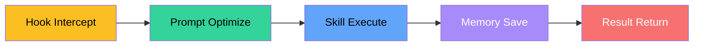

<div align="center">

<h1 style="font-size: 4em; font-weight: 900; margin-bottom: 0.2em; letter-spacing: 0.1em;">Kim - Service</h1>
<p style="font-size: 1.2em; color: #7c3aed; font-weight: 600; margin-top: 0;">Toolkit</p>

<p>
  <a href="README.md">English</a> |
  <a href="README.zh-CN.md">简体中文</a>
</p>

<p>
  
  
</p>

</div>

## Overview

**Kim - Service** is a toolkit for AI coding assistants, providing reusable Hooks and Skills for Claude Code and Codex.

### One-line summary

> **Package production-grade tools into plug-and-play components, supercharging AI coding assistants.**

This is not a simple script collection — it is a battle-tested productivity toolkit, ready to use out of the box.

## Quick Start

```bash
# Clone to local
git clone https://github.com/KimYx0207/Kim_Service.git
cd Kim_Service

# Use with Claude Code or Codex
# Just copy the corresponding directory to your project root
```

---

## Directory Structure

```
Kim_Service/
├── Hooks/
│   └── Hook_Prompt/              # Prompt Auto-Optimizer Hook
│       ├── .claude/
│       │   ├── hooks/            # Hook scripts
│       │   ├── prompt-optimizer-meta.md
│       │   └── settings.json
│       └── README.md
├── Skills/
│   ├── Agent_Teams_Playbook/    # Agent Teams Orchestration
│   │   └── agent-teams-playbook/
│   ├── Claude_Memory_3layer/    # Three-Layer Memory System
│   │   ├── hooks/               # Memory hooks
│   │   └── commands/            # Memory commands
│   ├── Find_Skill/              # Skill Discovery Tool
│   └── Kim_Decision/            # Decision Framework
├── README.md
└── LICENSE
```

## Components

### Hooks

| Name | Runtime | Description |
|------|---------|-------------|
| Hook_Prompt | Claude Code / Codex | Auto-optimize vague requests into professional prompts, integrating Google's prompt engineering best practices |

### Skills

| Name | Trigger Words | Description | Runtime |
|------|---------------|-------------|---------|
| agent-teams-playbook | multi-agent, agent collaboration, agent orchestration | Cross-platform Agent Teams orchestration playbook | Claude Code / Codex |
| claude-memory-3layer | three-layer memory, cross-session memory | Three-layer memory system, cross-session persistent knowledge | Claude Code |
| find-skill | find skill, discover skill | Skill discovery and installation | Claude Code / Codex |
| Kim_Decision | decision, choice | Decision framework and examples | All platforms |

## Architecture: Toolchain + Workflow

Kim_Service components can be used independently or combined into a complete workflow:



### Hook Layer

In Claude Code, Hooks implement automation:

- **Prompt Optimization**: Auto-optimize user input into professional prompts
- **Dangerous Command Interception**: Prevent accidental operations
- **Formatting**: Auto-format after editing
- **Memory Save**: Auto-save context at session end

### Skill Layer

Skills provide professional capabilities:

- **Agent Teams**: Multi-agent collaboration orchestration
- **Memory**: Three-layer cross-session memory
- **Decision**: Decision framework

---

## Installation

### Project Install (Claude Code)

Copy `.claude/` directory to your project root:

```bash
# Unix/macOS
cp -r Hooks/Hook_Prompt/.claude /your-project/

# Windows
xcopy /E /I Hooks\Hook_Prompt\.claude your-project\
```

### Global Install

```bash
# Claude Code
mkdir -p ~/.claude/hooks
cp -r Hooks/Hook_Prompt/.claude/hooks/* ~/.claude/hooks/
cp Hooks/Hook_Prompt/.claude/prompt-optimizer-meta.md ~/.claude/

# Codex
mkdir -p ~/.codex/hooks
cp -r Hooks/Hook_Prompt/.claude/hooks/* ~/.codex/hooks/
```

### Install Skills

```bash
# Claude Code
claude skill install KimYx0207/agent-teams-playbook

# or use npx
npx --yes github:KimYx0207/Kim_Service/skills/agent-teams-playbook
```

---

## Platform Support

| Platform | Hooks | Skills | Notes |
|----------|-------|--------|-------|
| **Claude Code** | ✅ | ✅ | Primary editing runtime |
| **Codex** | ✅ | ✅ | hooks.json support |

---

## Maintenance Commands

| Command | Description |
|---------|-------------|
| Hook_Prompt Test | `node test-hook.js` |
| Validate Hook Config | Check `.claude/settings.json` |

---

## License

This project is open source under MIT License, see [LICENSE](LICENSE) file.

---

## Contact

GitHub <a href="https://github.com/KimYx0207">KimYx0207</a> |
X <a href="https://x.com/KimYx0207">@KimYx0207</a> |
Website <a href="https://www.aiking.dev/">aiking.dev</a>

---

## License

This project is licensed under [MIT License](LICENSE).