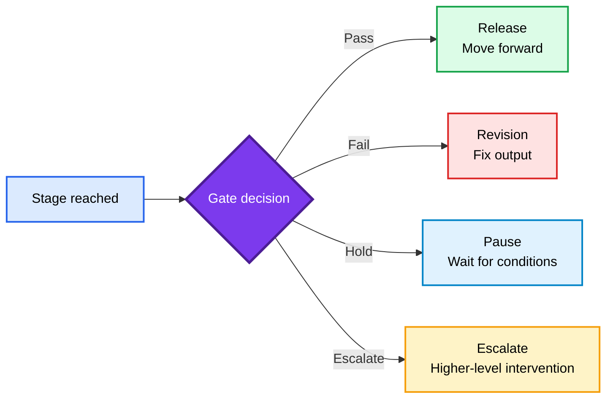
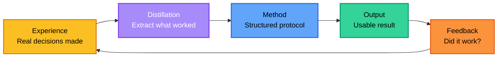

<div align="center">

<h1 style="font-size: 4em; font-weight: 900; margin-bottom: 0.1em; letter-spacing: 0.05em;">KIM</h1>
<p style="font-size: 1.1em; color: #7c3aed; font-weight: 600; margin-top: 0;">DECISION & DELIVERY PROTOCOL</p>

<p>
  <a href="README.md">English</a> |
  <a href="README.zh-CN.md">简体中文</a>
</p>

<p>
  
  
  
  
</p>

</div>

## Overview

**KIM Skill** is a decision protocol for turning fuzzy questions into usable next actions.

It is built for the moments where a normal prompt usually produces confident but vague advice: should I launch, sell, price, cut scope, change direction, or run a test first? KIM forces the agent to state the intent, map the path, label the evidence, define the smallest useful test, and end with something you can execute.

Most AI skills tell the model *what style to use*. KIM asks a different question: **does the agent actually have a method for reaching a usable result — or is it just improvising with confidence?**

> The point is simple: less inspirational advice, more decisions that can be tested.

Without a method, the model improvises. With KIM, every output follows one spine:

```mermaid
flowchart LR
    subgraph define["Define"]
        I["Intent<br/>What must change"] --> S["Subject<br/>Who experiences it"]
        S --> P["Path<br/>How they get there"]
    end

    subgraph verify["Verify"]
        C["Constraint<br/>Hard limits"]
        E["Evidence<br/>Confirmed or not"]
        MT["Minimum Test<br/>Smallest decider"]
        P --> C --> E --> MT
    end

    subgraph deliver["Deliver"]
        M["Models<br/>Abstract tools"]
        G["Gates<br/>Pass or fail"]
        O["Output<br/>Usable result"]
        MT --> M --> G --> O
    end

    style define fill:#fef3c7,stroke:#f59e0b,color:#000
    style verify fill:#dbeafe,stroke:#2563eb,color:#000
    style deliver fill:#dcfce7,stroke:#16a34a,color:#000

    style I fill:#fbbf24,stroke:#d97706,color:#000,stroke-width:2px
    style S fill:#60a5fa,stroke:#2563eb,color:#000,stroke-width:2px
    style P fill:#34d399,stroke:#059669,color:#000,stroke-width:2px
    style C fill:#fb923c,stroke:#ea580c,color:#000,stroke-width:2px
    style E fill:#a78bfa,stroke:#7c3aed,color:#fff,stroke-width:2px
    style MT fill:#2dd4bf,stroke:#0d9488,color:#000,stroke-width:2px
    style M fill:#f87171,stroke:#dc2626,color:#fff,stroke-width:2px
    style G fill:#818cf8,stroke:#6366f1,color:#fff,stroke-width:2px
    style O fill:#fbbf24,stroke:#d97706,color:#000,stroke-width:2px
```



The operating layer stays abstract — no hardcoded personas. The delivery layer allows concrete evidence when real names, cases, data, or file paths improve trust.

### One-line summary

> Define intent, map the path, verify evidence, run the minimum test, pass the gates, deliver the usable result.

This is not a new concept. Mature decision teams already do this. KIM turns it into a runnable protocol for AI, instead of relying on human discipline alone.

### What KIM is and is not

| Concept | What it is | What it is not |
|---------|-----------|---------------|
| **KIM** | A decision and delivery protocol | A persona prompt or character template |
| **Abstract method** | Transferable across any task | Locked to one voice or style |
| **Concrete evidence** | Verified facts that build trust | Invented claims dressed as knowledge |
| **Gates** | Pass/fail checkpoints between stages | The stages themselves |
| **Minimum test** | The smallest experiment that changes the decision | A small task or a trivial check |

### Quick example

**You ask:**

> I want to use AI to make extra money this month. Should I sell AI poster packages to local restaurants?

**KIM outputs (business format):**

```
## Breakdown
- Intent: Make first revenue from a small AI service within 30 days
- Subject: Local restaurant owners who need fresh promotion material but do not have a designer
- Path: Identify owner -> show sample poster -> offer fixed package -> collect deposit -> deliver first batch -> ask for monthly renewal
- Constraint: Solo operator, no ad budget, 30-day target, must use tools already available
- Acceptance: At least 3 paying customers, each paying ¥299 or more, with one customer willing to renew

## Decision
Proceed, but sell a narrow "weekly restaurant promo poster package", not a generic AI design service.

## Path
- Motive: Restaurant owners need visible offers for lunch specials, delivery platforms, WeChat groups, and storefront posters.
- Interpretation: "AI design" sounds abstract; "4 promo posters for this week's dishes" sounds like a concrete business result.
- Action: Make 3 sample posters for one real restaurant category, then sell the package in person or through WeChat.
- Resistance: Owners may distrust AI output and may not want to think through design requirements.
- Signal: They ask "can you make one for my menu?" or "how much for a month?" instead of asking how the AI works.
- State change: The owner moves from "interesting tool" to "this can help me sell today's dishes".
- Continuation: If one weekly batch is accepted, convert it into a monthly package.

## Evidence
- User-provided, tier A: The 30-day income goal and solo-operator constraint come from the question.
- Confirmed, tier A: A paid order is the only valid proof; likes, compliments, and "looks good" are not revenue.
- Inference, tier C: Restaurants are better first customers than broad "small businesses" because the offer can be tied to visible daily sales.
- Unconfirmed, tier D: Local owners' willingness to pay ¥299+ is unknown until tested.

## Data gaps
- Local willingness to pay is unknown. If owners reject ¥299, test ¥99 one-off posters before abandoning the channel.
- Delivery time is unknown. If one package takes more than 90 minutes, the service will not scale as a side income.

## Minimum test
- Goal: Validate that local owners will pay for a narrow AI-assisted poster package
- Input: 10 nearby restaurants or food stalls with visible promotions
- Action: Create 3 sample posters for one category, then pitch a ¥299 package: 4 posters delivered within 24 hours
- Output: Deposits collected, delivery time per package, owner feedback
- Pass condition: 3 paid deposits within 7 days and average delivery time <=90 minutes per customer
- Fail signal: Fewer than 2 deposits after 10 direct pitches, or every buyer asks for heavy custom edits
- Next step: If pass, sell a ¥799/month renewal package with 4 weekly batches
- Do not do: Build a website, run ads, make 20 service packages, or sell "AI consulting" before the first paid order

## Gates
- Evidence gate: HOLD — willingness to pay is unconfirmed until direct pitches happen.
- Revenue gate: PASS for test — payer, price, urgency, delivery cost, and repeat path are defined.
- MVP gate: PASS — one package, one customer type, 7-day test.
- Delivery gate: PASS if the 24-hour delivery promise is met without custom design chaos.

## Model check
- Friction: A generic service creates too much explanation. A fixed poster package reduces buyer thinking.
- Incentive: Owners care about more orders, not AI. The pitch must show the dish, price, and promotion channel.

## Business check
The play makes money only if an owner pays for a result they already understand: better-looking promotion material for dishes they are trying to sell this week. The payer is the owner or store manager. The first deal size is ¥299 because it is small enough for impulse testing but high enough to expose whether the service has value.

V1 does one thing only: 4 promo posters for one restaurant, delivered in 24 hours. Exclude logo design, menu redesign, brand strategy, video, ad buying, and long copywriting. Week one quick win is simple: a store owner receives usable posters and asks for the next batch.

## Usable result
1. Pick one category today: milk tea, hotpot, lunch set, barbecue, or bakery.
2. Make 3 sample posters for that category with the same package promise: "4 promo posters, delivered in 24 hours, ¥299."
3. Pitch 10 nearby owners in person or on WeChat before changing the offer.
4. Take a deposit before doing custom work.
5. Continue only if 3 owners pay within 7 days and delivery stays under 90 minutes per customer.
```

**You ask:**

> My short-video account gets views but makes no money. What should I sell first?

**KIM outputs (default format):**

```
## Breakdown
- Intent: Turn existing attention into first revenue
- Subject: Viewers who already watch the account for practical advice
- Path: Watch video -> trust the problem diagnosis -> want a shortcut -> buy a small template/service -> get result -> return for a larger offer
- Constraint: No audience size, niche, price point, or conversion data provided
- Acceptance: First 10 paid orders from current audience without paid ads

## Decision
Sell the smallest paid shortcut related to the content that already gets comments, not a course, community, or broad consulting offer.

## Path
- Motive: Viewers want a faster path from "I learned something" to "I can use this today".
- Interpretation: A low-price template feels safer than a high-price promise.
- Action: Package the top repeated problem into a ¥19-¥99 downloadable template, checklist, or mini diagnosis.
- Resistance: Viewers may like the content but not trust the paid result yet.
- Signal: Comments asking "can you send the template?", "how do I do this?", or "can you look at mine?".
- State change: The account changes from attention collection to transaction testing.
- Continuation: Buyers of the small product become candidates for service, membership, or higher-ticket delivery.

## Evidence
- User-provided, tier A: The account has views but no revenue.
- Confirmed, tier A: Revenue requires a paid offer; views alone are not a monetization model.
- Inference, tier C: Repeated viewer questions are the best source for the first paid product.
- Unconfirmed, tier D: Audience size, niche, comment quality, and buyer urgency are unknown.

## Data gaps
- Niche is unknown. If the account is entertainment-only, templates may fail; if it teaches a practical skill, templates are likely the fastest test.
- Comment and DM history are unknown. The first offer should be chosen from repeated requests, not from the creator's favorite idea.

## Minimum test
- Goal: Validate whether viewers will pay for a practical shortcut.
- Input: Last 30 videos, top 20 comments, all DMs from the last 14 days.
- Action: Pick the most repeated painful question and sell one ¥19-¥99 template with a pinned comment and DM reply.
- Output: Clicks, paid orders, refund/complaint rate, buyer questions.
- Pass condition: 10 paid orders or >=3% purchase rate from link clicks within 7 days.
- Fail signal: High clicks but zero purchases, or buyers cannot use the template without personal help.
- Next step: If pass, create a ¥299 service version for people who want it done for them.
- Do not do: Launch a course, paid group, or coaching package before proving one small paid shortcut.

## Gates
- Evidence gate: HOLD — audience behavior must be checked in comments, DMs, and link clicks.
- Revenue gate: HOLD — payer urgency and price tolerance are unverified.
- Minimum-test gate: PASS — the 7-day paid template test is small enough to run immediately.

## Model check
- Friction: A course asks for too much trust too early; a template asks for a small decision.
- Feedback: Paid orders are stronger signal than views, likes, saves, or praise.

## Business check
The first product should be a paid shortcut, not a content extension. The payer is the viewer who has the problem now. The urgency comes from saving time or avoiding a mistake. The first deal size can be ¥19-¥99; delivery cost stays low if the output is a reusable file. Repeat purchase becomes possible only after the first buyer gets a usable result.

V1 is one template that solves one repeated viewer problem. Exclude full courses, communities, personal coaching, private groups, and custom work. The quick win is a buyer saying the template helped them finish a task faster.

## Usable result
1. Export the last 30 video titles, top 20 comments, and all DMs from the last 14 days.
2. Count repeated painful questions; pick the one with the clearest buyer urgency.
3. Build one template/checklist in 2 hours and price it at ¥19-¥99.
4. Add one pinned comment: "Need the template? Reply 'template' and I will send the link."
5. Continue only if the offer gets 10 paid orders or >=3% purchase rate from link clicks in 7 days.
```

Every answer must be specific enough to act on immediately. If it is not, the answer is a list of questions to resolve first.

## Quick Start

KIM supports both Claude Code and Codex:

- `.claude/skills/Kim/` is for Claude Code.
- `.agents/skills/Kim/` is for Codex.

**Claude Code personal install** (available in every project):

```bash
mkdir -p ~/.claude/skills && cp -R Kim ~/.claude/skills/Kim
```

**Claude Code project install** (scoped to one repo):

```bash
mkdir -p .claude/skills && cp -R Kim .claude/skills/Kim
```

**Codex project install** (scoped to one repo):

```bash
mkdir -p .agents/skills && cp -R Kim .agents/skills/Kim
```

Recommended reading order:

1. `.claude/skills/Kim/SKILL.md` or `.agents/skills/Kim/SKILL.md` — the full operating protocol
2. `references/method.md` — the frame with examples
3. `references/path.md` — subject movement analysis
4. `references/models.md` — abstract decision models
5. `references/gates.md` — stage passage control

### Usage paths

| Task | Method focus | Output |
|---|---|---|
| **Decision** | Intent, evidence, model check | Decision and next action |
| **Calibration** | Path break, resistance, signal | Fix and pass condition |
| **Creation** | Subject, narrative, evidence | Draft or template |
| **Debugging** | Symptom, evidence, root cause | Verified fix |
| **Strategy** | Constraint, minimum test, gate | Action plan |
| **Monetization** | Revenue, payer, urgency, delivery loop | First paid test |

---

## Contact


GitHub <a href="https://github.com/KimYx0207">KimYx0207</a> |
X <a href="https://x.com/KimYx0207">@KimYx0207</a> |
Website <a href="https://www.aiking.dev/">aiking.dev</a> |
WeChat Official Account: <strong>老金带你玩AI</strong>

Feishu knowledge base:
<a href="https://my.feishu.cn/wiki/OhQ8wqntFihcI1kWVDlcNdpznFf">long-term updates</a>

### Buy me a coffee

If KIM Skill has been useful, support the project with a coffee.

<table align="center">
<tr><th>WeChat Pay</th><th>Alipay</th></tr>
<tr>
<td align="center"></td>
<td align="center"></td>
</tr>
</table>

### Method basis

KIM Skill's methodological foundation comes from my research on meta-based intent amplification:

- Paper: <https://zenodo.org/records/18957649>
- DOI: `10.5281/zenodo.18957649`

---

## Method Architecture

This is the core design of KIM. If you only read one section, read this one.

### The spine

```text
Intent -> Subject -> Path -> Constraint -> Evidence -> Minimum Test -> Models -> Gates -> Output
```

Every KIM output walks through this spine. The question is never "what style should the agent use" — it is "has the agent actually followed the method."

### Output modes

| Mode | When | Structure |
|------|------|-----------|
| **Default output** | Complex task, multi-step decision | Breakdown, Decision, Path, Evidence, Data gaps, Minimum test, Gates, Model check, Business check (when commercial), Usable result |
| **Business output** | Monetization, pricing, client delivery, MVP scope | Same rigor as default output, but Business check reads like a business conversation instead of a filled form |
| **Short output** | Single focused question, narrow scope, no commercial dimension | Decision, Main path break, Do now (1-2-3), Do not do, Pass condition |

### Gates

A stage reached is not a stage passed.



Gates exist to stop AI from skipping steps. Reaching a stage means you are there; passing the gate means you are allowed to move on.

### Closed loop

The method does not end at Output. Every result feeds back into the method itself — this is the distillation loop:



Experience → distill → method → output → feedback → experience. Every cycle sharpens the protocol.

### Core frame fields

| Field | What it does |
|-------|-------------|
| **Intent** | State what must change. A good intent is an outcome, not a topic. |
| **Subject** | State who experiences the result. Can be a user, buyer, reader, team, system, or decision maker. |
| **Path** | Map how the subject moves from current state to target state: Motive → Interpretation → Action → Resistance → Signal → State Change → Continuation |
| **Constraint** | State the hard limits: time, budget, people, tools, rules, data, risk tolerance. |
| **Evidence** | Separate into: Confirmed, User-provided, Inference, Unconfirmed. Verify claims that depend on external rules, systems, or market conditions. |
| **Minimum Test** | Define the smallest test that can change the decision. Must include: Goal, Input, Action, Output, Pass condition, Fail signal, Next step, Do not do. |
| **Models** | Use abstract decision models (Essence, Path, Constraint, Incentive, Friction, Probability, Risk, Feedback, Compounding, Boundary, Narrative). Pick the smallest set that can improve the answer. |
| **Gates** | Stop skipped steps. A stage reached is not a stage passed. |
| **Output** | Return a usable artifact: decision, path, checklist, template, acceptance criteria, or next action. |

### Design rules

| Rule | Why |
|------|-----|
| Keep the operating method abstract | Concrete personas lock the model into one voice; abstract methods transfer across tasks |
| Use concrete evidence in final answers | Real names, tools, data, and dates improve trust — but only when verified |
| Label all uncertainty | Unconfirmed claims must be tagged; never present inference as fact |
| End with a usable result | Every response must be specific enough to execute without further research |
| Data gap protocol | When key evidence is missing, state what is missing and ask — never guess |
| Information density | Every sentence must carry new information. Cut sentences that restate the obvious |
| Concrete delivery | Prefer exact tools, exact actions, exact thresholds. If you cannot be concrete, the result is a list of questions to answer first |

---

## Files

```text
.agents/skills/Kim/        # Codex skill package
.claude/skills/Kim/
├── SKILL.md              # Full operating protocol
├── references/
│   ├── method.md         # Core frame with examples
│   ├── path.md           # Subject movement analysis
│   ├── models.md         # Abstract decision models
│   ├── gates.md          # Stage passage control (11 gates)
│   ├── business.md       # Business decision layer
│   ├── output.md         # Deliverable standards
│   └── verification.md   # Completion checklist
└── examples/
    ├── decision.md
    ├── calibration.md
    ├── creation.md
    └── debugging.md
```

---

## Contributing

Found a gap or want to improve a reference? Open an Issue first, then submit a PR. Keep the method abstract — do not add persona-specific content.

---

## Further Reading

- [README.zh-CN.md](README.zh-CN.md)
- [SKILL.md](.claude/skills/Kim/SKILL.md) — the full operating protocol
- [references/method.md](.claude/skills/Kim/references/method.md) — the frame with examples

---

## License

Dual licensed under:

- MIT License
- Apache License 2.0

Use either license.
