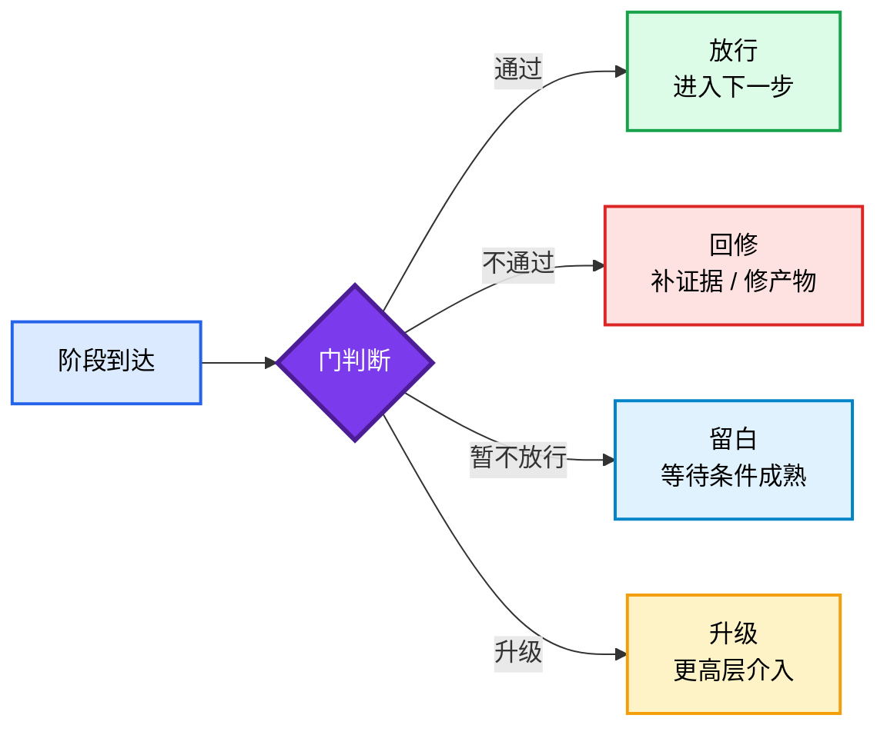
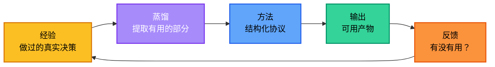

<div align="center">

<h1 style="font-size: 4em; font-weight: 900; margin-bottom: 0.1em; letter-spacing: 0.05em;">老金</h1>
<p style="font-size: 1.1em; color: #7c3aed; font-weight: 600; margin-top: 0;">判断与交付协议</p>

<p>
  <a href="README.md">English</a> |
  <a href="README.zh-CN.md">简体中文</a>
</p>

<p>
  
  
  
  
</p>

</div>

## 简介

**老金 Skill** 是一套把模糊问题变成可执行下一步的判断协议。

它适合处理普通提示词最容易输出空话的场景：要不要上线、卖什么、怎么定价、范围砍到哪里、方向要不要换、先做哪个验证。老金会强制 Agent 说清意图、路径、证据、最小验证和通过标准，最后交付一个能直接执行的结果。

打个比方：大多数 AI skill 告诉模型"用什么风格说话"。老金问的是另一个问题：**Agent 到底有没有一套方法，能把任务推进到可用结果——还是只是在自信满满地胡说八道？**

> 目标很简单：少一点热血建议，多一点能验证、能执行、能交付的判断。

没有方法，模型就是即兴发挥。有了老金，每个输出都沿着一条主干走：

```mermaid
flowchart LR
    subgraph define["定义阶段"]
        I["意图<br/>要改变什么"] --> S["主体<br/>谁经历结果"]
        S --> P["路径<br/>怎么走到目标"]
    end

    subgraph verify["验证阶段"]
        C["约束<br/>硬边界"]
        E["证据<br/>确认还是推断"]
        MT["最小验证<br/>最小有效实验"]
        P --> C --> E --> MT
    end

    subgraph deliver["交付阶段"]
        M["模型<br/>抽象判断工具"]
        G["硬门<br/>通过或不通过"]
        O["输出<br/>可用产物"]
        MT --> M --> G --> O
    end

    style define fill:#fef3c7,stroke:#f59e0b,color:#000
    style verify fill:#dbeafe,stroke:#2563eb,color:#000
    style deliver fill:#dcfce7,stroke:#16a34a,color:#000

    style I fill:#fbbf24,stroke:#d97706,color:#000,stroke-width:2px
    style S fill:#60a5fa,stroke:#2563eb,color:#000,stroke-width:2px
    style P fill:#34d399,stroke:#059669,color:#000,stroke-width:2px
    style C fill:#fb923c,stroke:#ea580c,color:#000,stroke-width:2px
    style E fill:#a78bfa,stroke:#7c3aed,color:#fff,stroke-width:2px
    style MT fill:#2dd4bf,stroke:#0d9488,color:#000,stroke-width:2px
    style M fill:#f87171,stroke:#dc2626,color:#fff,stroke-width:2px
    style G fill:#818cf8,stroke:#6366f1,color:#fff,stroke-width:2px
    style O fill:#fbbf24,stroke:#d97706,color:#000,stroke-width:2px
```



设定层保持抽象——不写死具体角色。答复层允许具体——当真实的姓名、案例、数据或文件路径能增强可信度时可以使用，前提是必须经过验证。

### 一句话总结

> 先定义意图，再建立路径，再查验证据，再做最小验证，通过硬门后交付可用结果。

这不是什么新概念，成熟的决策团队一直在做这件事。只不过老金把它变成了一套 AI 可运行的协议，而不是靠人的自觉。

### 老金是什么、不是什么

| 概念 | 它是什么 | 它不是什么 |
|------|---------|-----------|
| **老金 Skill** | 判断和交付协议 | 角色扮演提示词或人设模板 |
| **抽象方法** | 可跨任务迁移的通用框架 | 锁死在一个声音或风格里 |
| **具体证据** | 经过验证的、能增强可信度的事实 | 编造的、披着知识外衣的声称 |
| **硬门** | 阶段之间的通过/不通过关卡 | 阶段本身 |
| **最小验证** | 能改变判断的最小有效实验 | 一个小任务或走过场的检查 |

### 快速示例

**你问：**

> 我想这个月用 AI 赚点钱，要不要卖本地餐饮店的 AI 海报套餐？

**老金输出（商业格式）：**

```
## 拆解
- 意图：30天内用一个小型 AI 服务拿到第一笔收入
- 主体：需要促销物料、但没有设计师的本地餐饮店老板
- 路径：找到老板 -> 展示样张 -> 报固定套餐 -> 收订金 -> 交付第一批 -> 争取月度续费
- 约束：单人操作、没有广告预算、30天内出结果、必须使用现有工具
- 验收标准：至少3个付费客户，每单不低于 ¥299，其中1个愿意续费

## 判断
可以做，但只卖“每周餐饮促销海报套餐”，不要卖泛泛的 AI 设计服务。

## 路径
- 动机：餐饮老板需要午餐套餐、外卖平台、微信群、店门口海报这些能马上用的促销素材。
- 理解：“AI 设计”太抽象；“本周菜品的4张促销海报”才像一个具体生意结果。
- 动作：先为一个真实餐饮品类做3张样张，再线下或微信直接销售套餐。
- 阻力：老板可能不信 AI 质量，也不愿意花时间讲设计需求。
- 信号：对方问“能不能按我菜单做一张？”或“包月多少钱？”，而不是问 AI 怎么做。
- 状态变化：老板从“这工具挺有意思”变成“这东西能帮我卖今天的菜”。
- 延续：第一周交付被接受后，再转成月度套餐。

## 证据
- 用户提供，A级：30天赚钱目标和单人操作约束来自提问。
- 已确认，A级：只有付费订单才算验证；点赞、夸好看、说有意思都不是收入。
- 推断，C级：餐饮店比泛泛的“小商家”更适合第一批客户，因为海报能直接绑定当天销售。
- 未确认，D级：本地老板是否愿意为 ¥299+ 付费，必须通过直接销售验证。

## 数据缺口
- 本地付费意愿未知。如果老板普遍拒绝 ¥299，就先测 ¥99 单张海报，不要直接放弃这个渠道。
- 交付耗时未知。如果一个套餐超过90分钟，作为副业就很难规模化。

## 最小验证
- 目标：验证本地老板是否愿意为一个窄 AI 海报套餐付费
- 输入：10家附近有促销需求的餐饮店或小吃摊
- 动作：先做一个品类的3张样张，然后推 ¥299 套餐：4张海报，24小时内交付
- 输出：订金数量、每单交付耗时、老板反馈
- 通过标准：7天内拿到3笔订金，且平均每个客户交付耗时 <=90分钟
- 失败信号：直接推10家后少于2笔订金，或每个客户都要求大量定制修改
- 下一步：如果通过，推出 ¥799/月续费套餐，每周交付4张
- 不要做：第一单之前不要做网站、投广告、设计20个套餐，或卖“AI 咨询”

## 硬门
- 证据门：暂缓 — 付费意愿必须等直接销售后才能确认。
- 收入门：测试通过 — 付款人、价格、急迫性、交付成本和复购路径都已定义。
- MVP 门：通过 — 一个套餐、一个客户类型、7天验证。
- 交付门：24小时交付不引发大量定制修改时才算通过。

## 模型校验
- 摩擦：泛泛的服务需要解释太多，固定套餐能减少老板的理解成本。
- 激励：老板关心的是多卖菜，不是 AI。话术必须展示菜品、价格和使用场景。

## 商业校验
这个玩法能不能赚钱，只看老板是否愿意为一个他已经理解的结果付费：本周菜品有更好看的促销物料。付款人是老板或店长。第一单定 ¥299，是因为金额足够低，方便测试；又不能低到完全验证不出价值。

V1 只做一件事：给一家餐饮店做4张促销海报，24小时内交付。明确不做 logo、菜单重设计、品牌策略、视频、投流和长文案。第一周的快赢就是：老板拿到能用的海报，并愿意问下一批怎么做。

## 可执行结果
1. 今天先选一个品类：奶茶、火锅、工作餐、烧烤、烘焙。
2. 为这个品类做3张样张，统一套餐承诺：“4张促销海报，24小时交付，¥299。”
3. 在改报价之前，先线下或微信直接联系10个附近老板。
4. 做定制图之前先收订金。
5. 只有7天内拿到3笔订金，且每个客户交付低于90分钟，才继续放大。
```

**你问：**

> 我的短视频账号有播放量但不赚钱，第一步应该卖什么？

**老金输出（完整格式）：**

```
## 拆解
- 意图：把已有注意力变成第一笔收入
- 主体：已经因为实用内容关注或观看账号的用户
- 路径：看视频 -> 信任问题判断 -> 想要捷径 -> 购买小模板/小服务 -> 得到结果 -> 回来购买更高阶产品
- 约束：暂未提供粉丝量、赛道、价格、转化数据
- 验收标准：不投广告，从现有观众里拿到前10笔付费订单

## 判断
先卖和高频评论问题直接相关的“小捷径”，不要一上来卖课、社群或泛咨询。

## 路径
- 动机：观众想从“我学到了”更快走到“我今天能用上”。
- 理解：低价模板比高价承诺更容易让观众迈出第一步。
- 动作：把最高频的痛点问题打包成 ¥19-¥99 的模板、清单或小诊断。
- 阻力：观众可能喜欢内容，但还不信付费结果。
- 信号：评论或私信里反复出现“模板能发我吗？”“这个怎么做？”“能不能帮我看一下？”。
- 状态变化：账号从收集注意力，切换到测试交易。
- 延续：购买小产品的人，才是后续服务、会员或高客单交付的候选人。

## 证据
- 用户提供，A级：账号有播放量但没有收入。
- 已确认，A级：收入必须来自明确付费 offer；播放量本身不是变现模式。
- 推断，C级：重复评论和私信，是第一个付费产品最可靠的来源。
- 未确认，D级：粉丝规模、赛道、评论质量和付费急迫性都未知。

## 数据缺口
- 赛道未知。如果是纯娱乐号，模板可能无效；如果是实用技能号，模板通常是最快验证。
- 评论和私信历史未知。第一个产品必须从重复需求里选，不要从创作者自己喜欢的想法里选。

## 最小验证
- 目标：验证观众是否愿意为一个实用捷径付费
- 输入：最近30条视频、前20条高频评论、最近14天全部私信
- 动作：选择重复最多、痛感最强的问题，做一个 ¥19-¥99 的模板，用置顶评论和私信回复销售
- 输出：点击数、订单数、退款/抱怨率、买家追问
- 通过标准：7天内10笔订单，或链接点击后的购买率 >=3%
- 失败信号：点击高但零购买，或买家不用一对一帮助就无法使用模板
- 下一步：如果通过，做 ¥299 的“帮你做一版”服务
- 不要做：在一个小付费捷径被验证前，不要开课、建付费群或卖咨询包

## 硬门
- 证据门：暂缓 — 需要先看评论、私信和链接点击。
- 收入门：暂缓 — 付款急迫性和价格承受力未验证。
- 最小验证门：通过 — 7天模板销售测试足够小，可以立刻跑。

## 模型校验
- 摩擦：课程需要太多信任，模板只需要一个小决策。
- 反馈：付费订单比播放、点赞、收藏、夸奖都更接近真实需求。

## 商业校验
第一个产品应该是“付费捷径”，不是内容延伸。付款人是现在就有这个问题的观众；急迫性来自省时间或少踩坑。第一单价格可以在 ¥19-¥99，交付成本要靠可复用文件压低。只有第一个买家真的拿到结果，后面才有复购或高客单的可能。

V1 只做一个模板，解决一个重复出现的问题。明确不做完整课程、社群、私教、付费群和定制服务。第一周的快赢是：买家说这个模板帮他更快完成了一件事。

## 可执行结果
1. 导出最近30条视频标题、前20条高频评论、最近14天私信。
2. 统计重复痛点，选择付费急迫性最明显的一个。
3. 2小时内做出一个模板/清单，定价 ¥19-¥99。
4. 置顶评论写：“需要模板，评论‘模板’，我发链接。”
5. 只有7天内拿到10笔订单，或链接点击购买率 >=3%，才继续放大。
```

每个回答都必须具体到可以直接执行。如果做不到，回答就是一串待解决的问题清单。

## 快速开始

KIM 同时支持 Claude Code 和 Codex：

- `.claude/skills/Kim/` 用于 Claude Code。
- `.agents/skills/Kim/` 用于 Codex。

**Claude Code 个人级安装**（所有项目可用）：

```bash
mkdir -p ~/.claude/skills && cp -R Kim ~/.claude/skills/Kim
```

**Claude Code 项目级安装**（仅限当前仓库）：

```bash
mkdir -p .claude/skills && cp -R Kim .claude/skills/Kim
```

**Codex 项目级安装**（仅限当前仓库）：

```bash
mkdir -p .agents/skills && cp -R Kim .agents/skills/Kim
```

建议阅读顺序：

1. `.claude/skills/Kim/SKILL.md` 或 `.agents/skills/Kim/SKILL.md` — 完整操作协议
2. `references/method.md` — 核心框架及示例
3. `references/path.md` — 主体运动分析
4. `references/models.md` — 抽象判断模型
5. `references/gates.md` — 阶段通过控制

### 使用路径

| 任务 | 方法重点 | 输出 |
|---|---|---|
| **决策** | 意图、证据、模型校验 | 结论和下一步 |
| **校准** | 路径断点、阻力、信号 | 修改方案和通过标准 |
| **创作** | 主体、叙事、证据 | 草稿或模板 |
| **排错** | 现象、证据、根因 | 已验证的修复路径 |
| **策略** | 约束、最小验证、硬门 | 行动方案 |
| **变现** | 收入、付款人、急迫性、交付闭环 | 第一笔付费验证 |

---

## 联系方式


GitHub <a href="https://github.com/KimYx0207">KimYx0207</a> |
X <a href="https://x.com/KimYx0207">@KimYx0207</a> |
官网 <a href="https://www.aiking.dev/">aiking.dev</a> |
微信公众号：<strong>老金带你玩AI</strong>

飞书知识库：
<a href="https://my.feishu.cn/wiki/OhQ8wqntFihcI1kWVDlcNdpznFf">长期更新入口</a>

### 请老金喝杯咖啡

如果老金 Skill 对你有帮助，欢迎请我喝杯咖啡，算是对持续维护的支持。

<table align="center">
<tr><th>微信支付</th><th>支付宝</th></tr>
<tr>
<td align="center"></td>
<td align="center"></td>
</tr>
</table>

### 方法依据

老金 Skill 的方法论基础来自我（KimYx0207）撰写的"基于元的意图放大"研究：

- 论文：<https://zenodo.org/records/18957649>
- DOI：`10.5281/zenodo.18957649`

---

## 方法架构

这是老金 Skill 最核心的设计。整篇文档最重要的就是这一节。

### 主干

```text
意图 -> 主体 -> 路径 -> 约束 -> 证据 -> 最小验证 -> 模型 -> 硬门 -> 输出
```

每个老金输出都沿着这条主干走。问题从来不是"Agent 应该用什么风格"，而是"Agent 有没有真正遵循方法"。

### 输出模式

| 模式 | 触发条件 | 结构 |
|------|---------|------|
| **完整输出** | 复杂任务、多步决策 | 拆解、判断、路径、证据、数据缺口、最小验证、硬门、模型校验、商业校验（商业决策时）、可执行结果 |
| **商业输出** | 变现、定价、客户交付、MVP 范围 | 保留完整判断结构，但商业校验要像商业对话，不像填表 |
| **简短输出** | 单一聚焦问题、范围窄、无商业维度 | 判断、主要路径断点、现在做、不做什么、通过标准 |

### 硬门

阶段到了，不代表能过门。



硬门存在的意义就是阻止 AI 跳步骤。到达一个阶段说明你到了；通过硬门才说明你配往前走。

### 闭环

方法不会在输出结束。每个结果都会反哺方法本身——这就是蒸馏循环：



经验 → 蒸馏 → 方法 → 输出 → 反馈 → 经验。每一轮都让协议更锋利。

### 核心框架字段

| 字段 | 作用 |
|------|------|
| **意图** | 明确要改变什么。好的意图是结果，不是主题。 |
| **主体** | 经历结果的人。可以是用户、买家、读者、团队、系统、决策者。 |
| **路径** | 映射主体从当前状态到目标状态的过程：动机 → 理解 → 行动 → 阻力 → 信号 → 状态变化 → 延续 |
| **约束** | 明确硬边界：时间、预算、人力、工具、规则、数据、风险承受能力。 |
| **证据** | 分为四类：已确认、用户给定、推断、未确认。依赖外部规则、系统或市场状态的内容必须验证。 |
| **最小验证** | 定义能改变判断的最小实验。必须包含：目标、输入、动作、输出、通过标准、失败信号、下一步、不做什么。 |
| **模型** | 使用抽象判断模型（本质、路径、约束、激励、摩擦、概率、风险、反馈、复利、边界、叙事），选最小的有效集合。 |
| **硬门** | 阻止跳步骤。阶段到达 ≠ 阶段通过。 |
| **输出** | 交付一个可用产物：决策、路径、检查清单、模板、验收标准、或下一步行动。 |

### 设计原则

| 原则 | 原因 |
|------|------|
| 操作方法保持抽象 | 具体角色会把模型锁死在一个声音里；抽象方法能跨任务迁移 |
| 答复中使用具体证据 | 真实的姓名、工具、数据、日期能增强可信度——但必须经过验证 |
| 标注所有不确定性 | 未确认的声称必须标记；永远不要把推断当作事实呈现 |
| 以可用结果收尾 | 每个回答都必须具体到可以直接执行，不需要再研究 |
| 数据缺口协议 | 当关键证据缺失时，说明缺什么、问用户要——永远不要猜 |
| 信息密度 | 每句话都必须承载新信息。删掉重复已知内容的句子 |
| 具体交付 | 优先给出精确的工具、精确的动作、精确的阈值。如果无法具体，结果就是一串待回答的问题 |

---

## 文件结构

```text
.agents/skills/Kim/        # Codex skill 包
.claude/skills/Kim/
├── SKILL.md              # 完整操作协议
├── references/
│   ├── method.md         # 核心框架及示例
│   ├── path.md           # 主体运动分析
│   ├── models.md         # 抽象判断模型
│   ├── gates.md          # 阶段通过控制（11个门）
│   ├── business.md       # 商业决策层
│   ├── output.md         # 交付标准
│   └── verification.md   # 完成度检查清单
└── examples/
    ├── decision.md
    ├── calibration.md
    ├── creation.md
    └── debugging.md
```

---

## 参与贡献

发现了方法论的缺口或想改进某个参考文档？先开 Issue，再提 PR。保持方法的抽象性——不要添加特定角色内容。

---

## 延伸阅读

- [README.md](README.md)
- [SKILL.md](.claude/skills/Kim/SKILL.md) — 完整操作协议
- [references/method.md](.claude/skills/Kim/references/method.md) — 核心框架及示例

---

## 协议

双协议：

- MIT License
- Apache License 2.0

任选其一使用。
