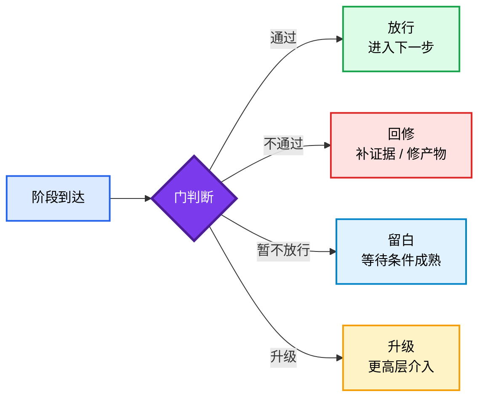
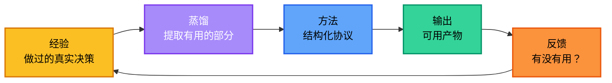

<div align="center">

<h1 style="font-size: 4em; font-weight: 900; margin-bottom: 0.1em; letter-spacing: 0.05em;">老金</h1>
<p style="font-size: 1.1em; color: #7c3aed; font-weight: 600; margin-top: 0;">判断与交付协议</p>

<p>
  语言：
  <a href="README.md">英文</a> |
  <a href="README.zh-CN.md">简体中文</a>
</p>

<p>
  
  
  
  
</p>

</div>

## 简介

**老金 Skill** 是我把自己多年的判断经验蒸馏之后装进 AI 里的产物。

这些年我摔过的坑、骂过的代码、拍过的桌子、做过的决策——我把那些"事后证明有用的部分"提炼出来，去掉了脏话（大部分），压缩成了一套 AI 可执行的协议。

打个比方：大多数 AI skill 告诉模型"用什么风格说话"。老金问的是另一个问题：**Agent 到底有没有一套方法，能把任务推进到可用结果——还是只是在自信满满地胡说八道？**

> 简单说就是：把老金脑子里的"判断酵母"从多年发酵的经验里萃取出来，装瓶，让任何 AI 都能倒一杯用。

没有方法，模型就是即兴发挥。有了老金，每个输出都沿着一条主干走：

```mermaid
flowchart LR
    subgraph define["定义阶段"]
        I["意图<br/>要改变什么"] --> S["主体<br/>谁经历结果"]
        S --> P["路径<br/>怎么走到目标"]
    end

    subgraph verify["验证阶段"]
        C["约束<br/>硬边界"]
        E["证据<br/>确认还是推断"]
        MT["最小验证<br/>最小有效实验"]
        P --> C --> E --> MT
    end

    subgraph deliver["交付阶段"]
        M["模型<br/>抽象判断工具"]
        G["硬门<br/>通过或不通过"]
        O["输出<br/>可用产物"]
        MT --> M --> G --> O
    end

    style define fill:#fef3c7,stroke:#f59e0b,color:#000
    style verify fill:#dbeafe,stroke:#2563eb,color:#000
    style deliver fill:#dcfce7,stroke:#16a34a,color:#000

    style I fill:#fbbf24,stroke:#d97706,color:#000,stroke-width:2px
    style S fill:#60a5fa,stroke:#2563eb,color:#000,stroke-width:2px
    style P fill:#34d399,stroke:#059669,color:#000,stroke-width:2px
    style C fill:#fb923c,stroke:#ea580c,color:#000,stroke-width:2px
    style E fill:#a78bfa,stroke:#7c3aed,color:#fff,stroke-width:2px
    style MT fill:#2dd4bf,stroke:#0d9488,color:#000,stroke-width:2px
    style M fill:#f87171,stroke:#dc2626,color:#fff,stroke-width:2px
    style G fill:#818cf8,stroke:#6366f1,color:#fff,stroke-width:2px
    style O fill:#fbbf24,stroke:#d97706,color:#000,stroke-width:2px
```



设定层保持抽象——不写死具体角色。答复层允许具体——当真实的姓名、案例、数据或文件路径能增强可信度时可以使用，前提是必须经过验证。

### 一句话总结

> 先定义意图，再建立路径，再查验证据，再做最小验证，通过硬门后交付可用结果。

这不是什么新概念，成熟的决策团队一直在做这件事。只不过老金把它变成了一套 AI 可运行的协议，而不是靠人的自觉。

### 老金是什么、不是什么

| 概念 | 它是什么 | 它不是什么 |
|------|---------|-----------|
| **老金 Skill** | 判断和交付协议 | 角色扮演提示词或人设模板 |
| **抽象方法** | 可跨任务迁移的通用框架 | 锁死在一个声音或风格里 |
| **具体证据** | 经过验证的、能增强可信度的事实 | 编造的、披着知识外衣的声称 |
| **硬门** | 阶段之间的通过/不通过关卡 | 阶段本身 |
| **最小验证** | 能改变判断的最小有效实验 | 一个小任务或走过场的检查 |

### 快速示例

**你问：**

> 产品现在上线还是再等一个月？

**老金输出（简短格式）：**

```
Decision:  等。先把新用户引导流程的流失问题修了再说。

Do now:
1. 把引导流程修复发上去（已经做了 80%，最多 2 天）
2. 找 5 个内测用户跑一遍看看
3. 如果 ≥ 4/5 说"比之前清晰" → 下周上线

Do not do:
- 今天就上线，引导流程以后再说
- 在修好流失问题之前加新功能

Pass condition:
测试组引导完成率 ≥ 60%（当前：34%）
```

**你问：**

> 我们的SaaS产品有5000个免费用户，但6个月只有47个付费转化，哪里出了问题？

**老金输出（完整格式）：**

```
## Breakdown
- Intent: 把免费用户付费转化率提升到 ≥3%（当前：0.94%）
- Subject: 触达3次导出付费墙的免费用户
- Path: 注册 → 触达导出限制 → 看到升级CTA → 转化或流失
- Constraint: 4周内没有工程资源（CTO李明在冲刺计划会上确认，2026-05-10），2人营销团队，预算 ≤¥5000
- Acceptance: 8周内付费转化率 ≥3%，通过 Stripe Dashboard 验证

## Decision
付费墙触发太早。用户还没体验到足够的价值就遇到收费。

## Path
- Motive: 用户注册是为了解决眼下的问题，不是来买订阅的
- Interpretation: 3次导出就收费感觉像陷阱——还没建立依赖就被要钱
- Action: 把付费墙触发点从3次导出推到10次（LaunchDarkly 开关，无需发版）
- Resistance: 如果核心功能不够粘，用户在10次之前就流失了
- Signal: 升级页面有访问但没有转化 = 价值缺口（Google Analytics → 行为流查看）
- State change: 用户在建立真实工作流依赖后才触达付费墙，不是第一天的碰壁
- Continuation: 转化后留存与每周活跃天数 ≥3天正相关（产品负责人张伟的队列分析，2026-04）

## Evidence
- Confirmed: 5000免费用户，47次付费转化，付费墙在3次导出（Stripe Dashboard，2026-04）
- User-provided: 4周内没有工程资源（CTO李明，冲刺计划会 2026-05-10）
- Inference: 首次会话就触达付费墙的用户转化率 <2%；第7天后触达的约8%（张伟的队列分析）
- Unconfirmed: 竞品付费墙阈值（Notion、Coda、Airtable 均未验证）；用户会话时长未按队列分段

## Data gaps
- 竞品付费墙触发点：如果竞品是5次导出，我们设10次可能过头；如果是15次，我们还偏保守。A/B 测试设计前需要手动核验。
- 用户分段的会话时长：张伟的分析是汇总数据，未按用户分段。已请求数据报告，预计 2026-05-18 出。

## Minimum test
- Goal: 验证延迟付费墙能否提升转化意愿
- Input: 200个即将触达付费墙的用户（Google Analytics → 事件 → "export_click" 筛选次数 ≥ 2）
- Action: 在 LaunchDarkly 把 PAYWALL_TRIGGER 从3切到10（PM自助操作，无需提工单）
- Output: 升级页面点击率 + 14天付费转化率
- Pass condition: 点击率 ≥12%（当前：6%）；测试队列转化率 ≥3%
- Fail signal: 点击率不变或总导出使用量下降 >15%
- Next step: 如果通过 → 请张伟出具分段报告 → 全量发布
- Do not do: 在确认付费墙时机之前修改定价层级或重新设计定价页面

## Gates
- Evidence gate: 通过 — Stripe + Google Analytics 确认数据；推断来源有具体人名和日期
- Data gap gate: 暂缓 — 竞品阈值和分段会话数据未确认，全量发布前必须解决
- Minimum test gate: 未开始 — 需要先配置 LaunchDarkly + 通过 GA 选定队列

## Model check
- Friction: 付费墙是过早放置的摩擦力 = 拒绝，而非转化
- Incentive: 用户需要7天以上养成习惯，才会觉得付费墙是公平的价值交换

## Usable result
1. 在 LaunchDarkly 把 PAYWALL_TRIGGER 从3切到10（PM自助操作，无需提工单）
2. 通过 Google Analytics → 事件 → "export_click" 筛选次数 ≥ 2 的用户，选出200人队列
3. 跑2周 A/B 测试；GA 监控点击率 + Stripe Dashboard 监控转化
4. 如果点击率 ≥12% 且转化 ≥3% → 拿到张伟的分段报告 → 全量发布
5. 如果不通过 → 暂停；先按分段调查会话时长，再调整策略
```

每个回答都必须具体到可以直接执行。如果做不到，回答就是一串待解决的问题清单。

## 快速开始

**个人级安装**（所有项目可用）：

```bash
mkdir -p ~/.claude/skills && cp -R laojin ~/.claude/skills/laojin
```

**项目级安装**（仅限当前仓库）：

```bash
mkdir -p .claude/skills && cp -R laojin .claude/skills/laojin
```

建议阅读顺序：

1. `SKILL.md` — 完整操作协议
2. `docs/zh-CN/SKILL.md` — 中文操作协议
3. `docs/zh-CN/references/method.md` — 核心框架及示例
4. `docs/zh-CN/references/path.md` — 主体运动分析
5. `docs/zh-CN/references/models.md` — 抽象判断模型
6. `docs/zh-CN/references/gates.md` — 阶段通过控制

### 使用路径

| 任务 | 方法重点 | 输出 |
|---|---|---|
| **决策** | 意图、证据、模型校验 | 结论和下一步 |
| **校准** | 路径断点、阻力、信号 | 修改方案和通过标准 |
| **创作** | 主体、叙事、证据 | 草稿或模板 |
| **排错** | 现象、证据、根因 | 已验证的修复路径 |
| **策略** | 约束、最小验证、硬门 | 行动方案 |

---

## 联系方式


GitHub <a href="https://github.com/KimYx0207">KimYx0207</a> |
X <a href="https://x.com/KimYx0207">@KimYx0207</a> |
官网 <a href="https://www.aiking.dev/">aiking.dev</a> |
微信公众号：<strong>老金带你玩AI</strong>

飞书知识库：
<a href="https://my.feishu.cn/wiki/OhQ8wqntFihcI1kWVDlcNdpznFf">长期更新入口</a>

### 请我一杯咖啡

如果 KIM Skill 帮到了你，欢迎请我喝杯咖啡，算是对持续维护的支持。

<table align="center">
<tr><th>微信支付</th><th>支付宝</th></tr>
<tr>
<td align="center"></td>
<td align="center"></td>
</tr>
</table>

### 方法依据

KIM Skill 的方法论基础来自本项目维护者（KimYx0207）撰写的"基于元的意图放大"研究：

- 论文：<https://zenodo.org/records/18957649>
- DOI：`10.5281/zenodo.18957649`

---

## 方法架构

这是老金 Skill 最核心的设计。整篇文档最重要的就是这一节。

### 主干

```text
意图 -> 主体 -> 路径 -> 约束 -> 证据 -> 最小验证 -> 模型 -> 硬门 -> 输出
```

每个老金输出都沿着这条主干走。问题从来不是"Agent 应该用什么风格"，而是"Agent 有没有真正遵循方法"。

### 输出模式

| 模式 | 触发条件 | 结构 |
|------|---------|------|
| **完整输出** | 复杂任务、多步决策 | Breakdown、Decision、Path、Evidence、Minimum test、Model check、Usable result |
| **简短输出** | 单一聚焦问题、要求快速回答、任务范围窄 | Decision、Do now (1-2-3)、Do not do、Pass condition |

### 硬门

阶段到了，不代表能过门。



硬门存在的意义就是阻止 AI 跳步骤。到达一个阶段说明你到了；通过硬门才说明你配往前走。

### 闭环

方法不会在输出结束。每个结果都会反哺方法本身——这就是蒸馏循环：



经验 → 蒸馏 → 方法 → 输出 → 反馈 → 经验。每一轮都让协议更锋利。

### 核心框架字段

| 字段 | 作用 |
|------|------|
| **意图** | 明确要改变什么。好的意图是结果，不是主题。 |
| **主体** | 经历结果的人。可以是用户、买家、读者、团队、系统、决策者。 |
| **路径** | 映射主体从当前状态到目标状态的过程：动机 → 理解 → 行动 → 阻力 → 信号 → 状态变化 → 延续 |
| **约束** | 明确硬边界：时间、预算、人力、工具、规则、数据、风险承受能力。 |
| **证据** | 分为四类：已确认、用户给定、推断、未确认。依赖外部规则、系统或市场状态的内容必须验证。 |
| **最小验证** | 定义能改变判断的最小实验。必须包含：目标、输入、动作、输出、通过标准、失败信号、下一步、不做什么。 |
| **模型** | 使用抽象判断模型（本质、路径、约束、激励、摩擦、概率、风险、反馈、复利、边界、叙事），选最小的有效集合。 |
| **硬门** | 阻止跳步骤。阶段到达 ≠ 阶段通过。 |
| **输出** | 交付一个可用产物：决策、路径、检查清单、模板、验收标准、或下一步行动。 |

### 设计原则

| 原则 | 原因 |
|------|------|
| 操作方法保持抽象 | 具体角色会把模型锁死在一个声音里；抽象方法能跨任务迁移 |
| 答复中使用具体证据 | 真实的姓名、工具、数据、日期能增强可信度——但必须经过验证 |
| 标注所有不确定性 | 未确认的声称必须标记；永远不要把推断当作事实呈现 |
| 以可用结果收尾 | 每个回答都必须具体到可以直接执行，不需要再研究 |
| 数据缺口协议 | 当关键证据缺失时，说明缺什么、问用户要——永远不要猜 |
| 信息密度 | 每句话都必须承载新信息。删掉重复已知内容的句子 |
| 具体交付 | 优先给出精确的工具、精确的动作、精确的阈值。如果无法具体，结果就是一串待回答的问题 |

---

## 文件结构

```text
laojin/
├── SKILL.md              # 完整操作协议
├── README.md
├── README.zh-CN.md
├── LICENSE-MIT
├── LICENSE-APACHE
├── NOTICE
├── references/
│   ├── method.md         # 核心框架及示例
│   ├── path.md           # 主体运动分析
│   ├── models.md         # 抽象判断模型
│   ├── gates.md          # 阶段通过控制
│   ├── output.md         # 交付标准
│   └── verification.md   # 完成度检查清单
├── examples/
│   ├── decision.md
│   ├── calibration.md
│   ├── creation.md
│   └── debugging.md
└── docs/
    ├── images/
    │   ├── contact-qr.png
    │   ├── wechat-pay.jpg
    │   └── alipay.jpg
    └── zh-CN/
        ├── SKILL.md
        ├── references/
        └── examples/
```

---

## 参与贡献

发现了方法论的缺口或想改进某个参考文档？先开 Issue，再提 PR。保持方法的抽象性——不要添加特定角色内容。

---

## 延伸阅读

- [README.md](README.md)
- [SKILL.md](SKILL.md) — 完整操作协议
- [docs/zh-CN/references/method.md](docs/zh-CN/references/method.md) — 核心框架及示例

---

## 协议

双协议：

- MIT License
- Apache License 2.0

任选其一使用。
